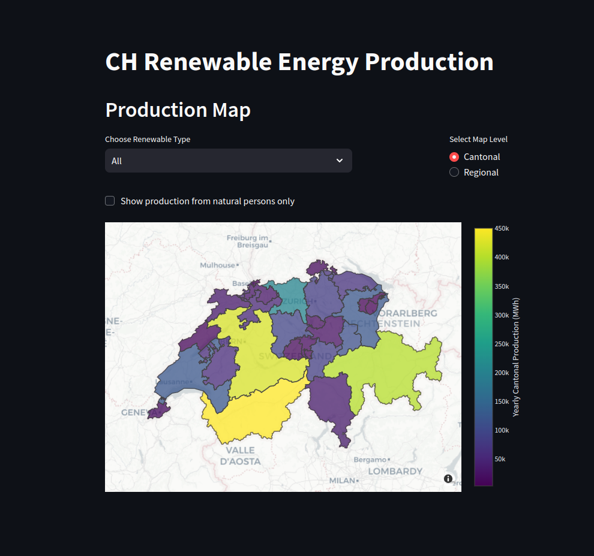

# CH Renewable Energy Production Dashboard

example image:

#### -- Project Status: [Active]

## Project Intro/Objective
The purpose of this project is to provide a dashboard of renewable energy production at different regional levels in Switzerland, sorted by renewable category. 

### Methods Used
* Data Visualization

### Technologies
* Python
* Pandas, Plotly, Streamlit

## Project Description
This project aims to provide visualization of the Swiss dataset as compiled by open-power-system-data [here] (https://open-power-system-data.org/)

## Getting Started
1. Clone this repo (for help see this [tutorial](https://help.github.com/articles/cloning-a-repository/)).
2. Package requirements are kept [here](requirements.txt)
3. Raw Data is being kept [here](./data/raw) within this repo.
4. Data processing/transformation scripts are being kept [here](canton_dicts.py)

## Featured Notebooks/Analysis/Deliverables
* N/A

## Contributing Members
**Team Leads (Contacts) : Rene Falquier (https://github.com/rmfalquier)**